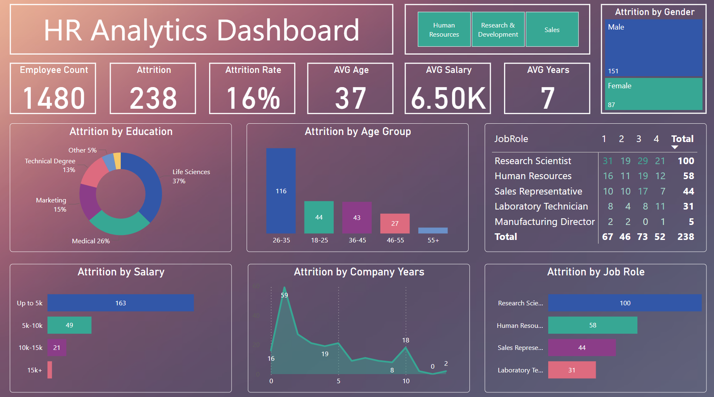

# 🧠 HR Analytics Dashboard – Power BI

---

## 📌 Project Overview

This project showcases a Power BI dashboard built to analyse employee attrition trends across departments, roles, education levels, and demographics. The dashboard provides HR stakeholders with a clear view of where and why employee turnover is occurring.

The dataset was pre-cleaned and structured, allowing the focus to remain on building dynamic, interactive visuals using relationships and slicers in Power BI.

---

## 🎯 Business Objective

HR leadership needs visibility into:
- Which departments and job roles have the highest attrition
- Which salary bands and education levels see the most turnover
- How attrition varies by age, gender, and years at the company
- Whether trends indicate possible retention risks

---

## 📊 Dashboard Features

The dashboard includes:
- KPI cards for **Employee Count**, **Attrition Rate**, **Average Age**, **Salary**, and **Tenure**
- Slicers for **Department** and **Gender**
- Bar and donut charts for:
  - Attrition by **Age Group**
  - Attrition by **Education**, **Salary Band**, and **Job Role**
  - Attrition by **Years at Company**
- Matrix table showing attrition counts by **Job Role and Performance Rating**

### 📸 Dashboard Overview

---

## 🧩 Data Model Overview

- The model includes 4 linked tables: `HR_Data`, `Departments`, `Education`, and `Jobs`
- Relationships are defined using foreign keys such as `Job_ID`, `Department_ID`, and `Education_ID`

> 📸 Data Model Screenshot  
> 

---

## 🛠 Tools & Skills Demonstrated

- **Power BI**: dashboard layout, slicers, KPIs, matrix tables, formatting
- **Data Modelling**: one-to-many relationships, lookup tables
- **Business Insight**: identifying key workforce trends
- **Communication**: building visuals that are executive-friendly and filterable

---

## 📬 Contact

📧 mitchellrogers.uk+github@gmail.com  
🔗 [Back to Portfolio](https://mjr-portfolio.github.io/mjr_analyst_portfolio.github.io/)
